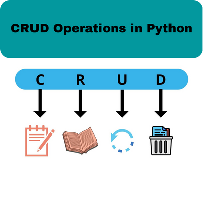

<h1 align="center">
C.R.U.D.
</h1>

<h1 align="center">

</h1>

<h2 align="center">
Information about the C.R.U.D.
</h2>

- C ➡ Creation in the database.
- R ➡ Reading from the database.
- U ➡ Database update.
- D ➡ Deleting database data.

<h2 align="center">
MySQL database integration 
</h2>

- No vs code import with mysql.connector.
- Creating connection function with host, user, password, database.
- In mysql the "bancoestudo" was created for the project with a table about sales. 
- Access the image file for more details. <a href="" target="_blank"> 📂</a>

<h3>Access my post on linkedin.</h3>

